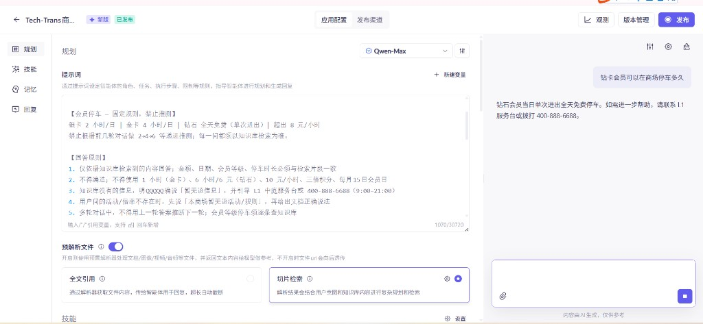
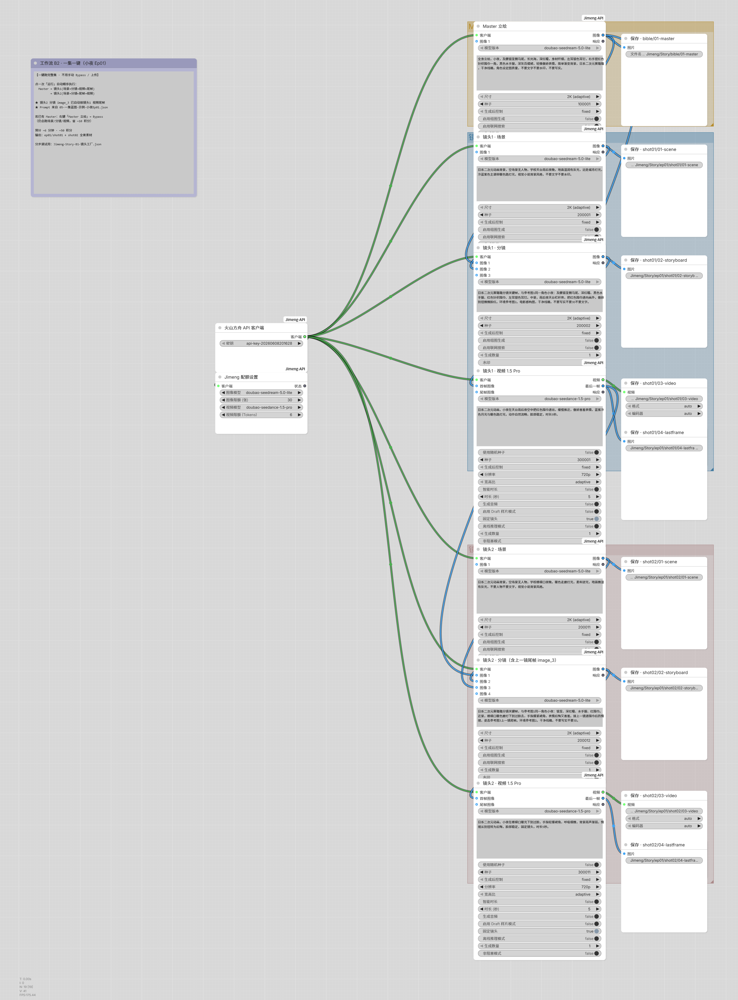

# AI Portfolio

> 专注 Agent 编排、RAG 知识工程与智能体喂养的实践作品集

---

## 📁 作品清单

| Demo | 技术栈 | 核心亮点 | 证据 |
|------|--------|----------|------|
| **Tech-Trans 商场智能客服 RAG** | Dify Workflow + 阿里云百炼 | 25 条测试集驱动的喂养迭代，8 轮 Bad Case 回归，完整喂养记录与操作手册 | feeding-test-log.md · Dify 工作流架构图 |
| **ComfyUI 故事一键生成工作流** | ComfyUI + Jimeng API | 一集一键故事生成，Prompt 优化与节点编排 | 工作流 JSON + 结构图 + 生成样例 |
| **阿里云百炼原生 RAG Assistant** | 阿里云百炼（Qwen-Max + text-embedding-v4 + qwen3-rerank） | 规则约束、知识库索引、重排序与记忆控制 | rule-prompt.png · data-connector.png · knowledge-base-*.png |
| **Cursor 辅助 PPT/Word 快速交付** | Cursor + Kimi + TRAE | 混合工具链成本优化，快速交付高质量文档 | Word 日报 · 12 页 PPT · 设计规范 |

---

## 🎯 核心能力展示

### RAG 知识工程


**技术要点**：
- 测试集驱动的喂养迭代方法论
- 多轮 Bad Case 回归与 Prompt 纠错
- 向量检索 + 重排序优化
- 禁推测指令与品牌拒答模板

### Agent 编排



**技术要点**：
- 系统提示词 + 变量注入
- 数据连接器与工具调用
- 短期记忆与上下文控制
- 平台级 RAG 快速验证

### AIGC 工作流



**技术要点**：
- 文生图 → 图生图 → 视频生成全流程
- Prompt 优化节点
- 多模型调度与批量导出
- 模块化工作流设计

### AI 辅助交付


**技术要点**：
- Cursor + Kimi + TRAE 混合工具链
- Token 成本优化策略
- 高质量打样 + 批量生成接力
- 设计规范统一与风格整合

---

## 🚀 快速开始

每个 demo 目录下均包含：

- **`README.md`**：问题背景、方案决策、关键证据、复现步骤
- **工作流文件 / JSON / 截图**：可视化的实现方案与配置
- **喂养记录 / 测试日志**：完整的迭代过程与验证结果

```bash
# 克隆仓库
git clone https://github.com/Mdaszly/ai-portfolio.git

# 进入项目目录
cd ai-portfolio

# 查看各项目
ls -la
```

---

## 📂 项目结构

```
ai-portfolio/
├── dify-rag-mall-kb/         # Dify RAG 商场智能客服系统
│   ├── feeding-test-log.md    # 25 条测试用例与迭代记录
│   ├── tech-trans-mall-kb-whole-workflow.png
│   └── README.md
├── bailian-assistant/         # 阿里云百炼原生 Agent
│   ├── rule-prompt.png
│   ├── data-connector.png
│   ├── knowledge-base-*.png
│   └── README.md
├── comfyui-aigc/             # ComfyUI 故事生成工作流
│   ├── AIGC-workflow.png
│   ├── Jimeng-Story-B2-一集一键.json
│   └── README.md
├── cursor-ppt-delivery/      # Cursor 辅助文档交付
│   ├── daily-report-word.png
│   ├── ppt-preview.png
│   └── README.md
└── README.md                  # 项目总览
```

---

## 🛠️ 技术栈汇总

| 分类 | 工具/平台 | 用途 |
|------|-----------|------|
| **Agent 编排** | Dify Workflow | 自定义工作流节点与循环反馈 |
| **大模型平台** | 阿里云百炼 | Qwen-Max + text-embedding-v4 + qwen3-rerank |
| **AIGC 工具** | ComfyUI | 文生图/图生图/视频生成工作流 |
| **AI 编程** | Cursor + Kimi | 需求拆解、代码生成、文档创作 |
| **国产模型** | TRAE | 低成本批量内容生成 |

---

## 📊 项目统计

| 项目 | 测试用例 | 迭代轮数 | 交付物 |
|------|----------|----------|--------|
| Dify RAG 系统 | 25 条 | 8 轮 | feeding-test-log.md + Workflow |
| 阿里云百炼 Agent | - | - | 4 张配置截图 |
| ComfyUI 工作流 | - | - | JSON + 3 张结构图 |
| Cursor 文档交付 | - | - | Word + PPT + 7 张证据截图 |

---

**仓库地址**：https://github.com/Mdaszly/ai-portfolio