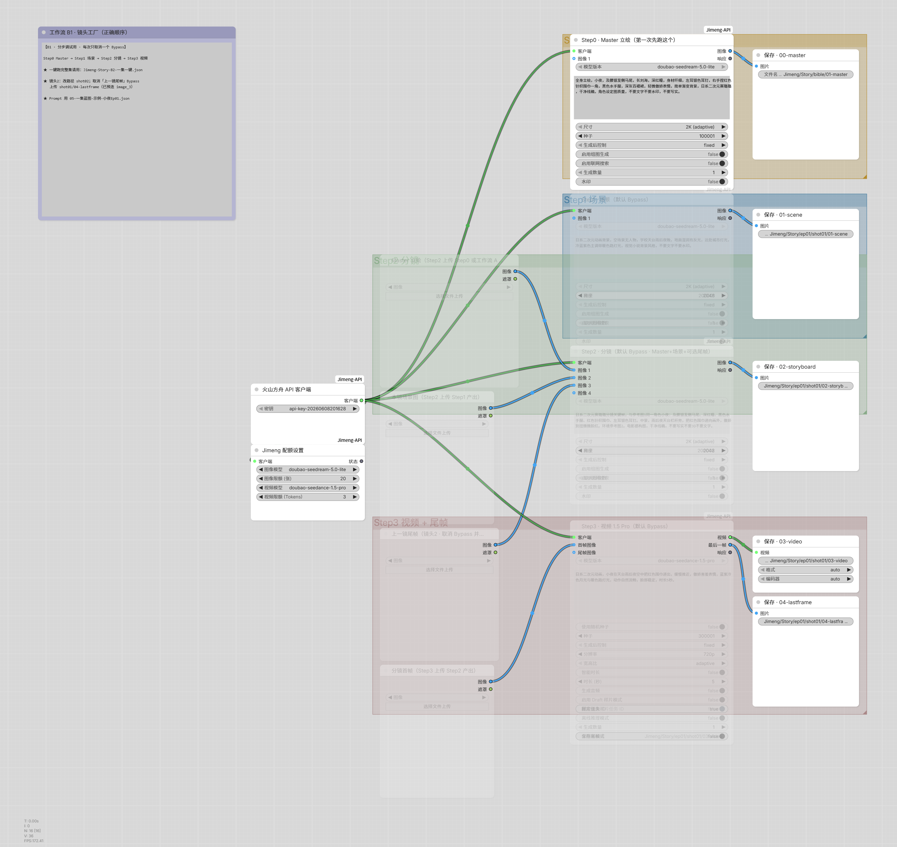
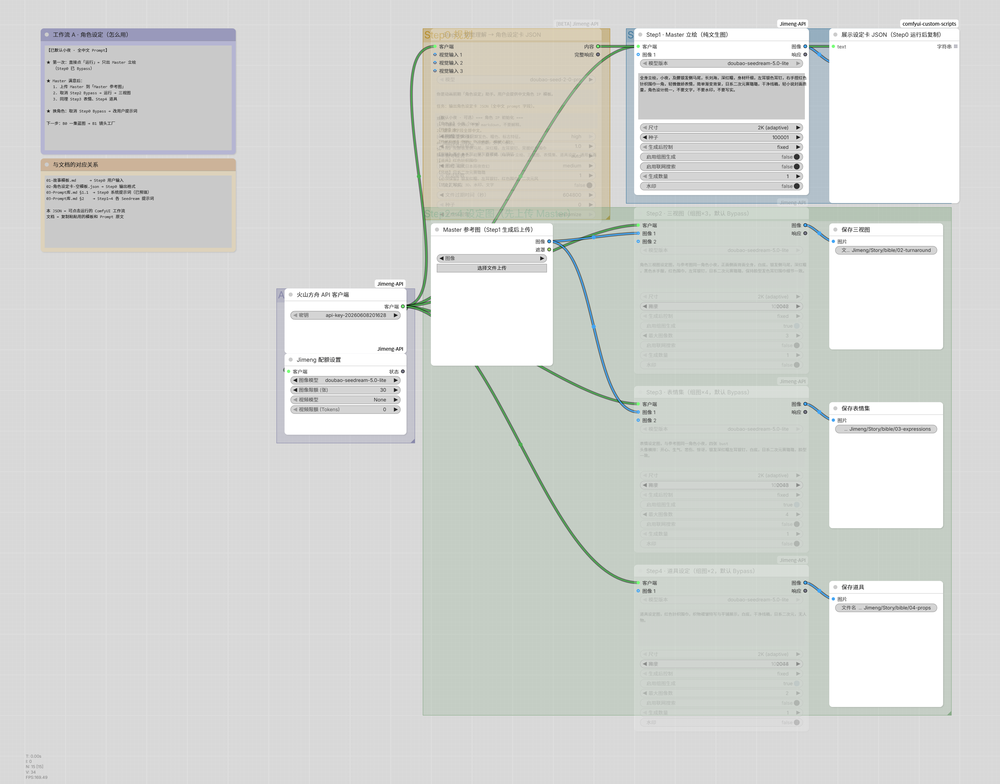

# ComfyUI 故事一键生成工作流

**技术栈**：ComfyUI + Jimeng API（即梦 AI）  
**工作流文件**：`Jimeng-Story-B2-一集一键.json`（F:\tech-trans-kb 目录下）  
**结构图**：`workflow-structure.png`（待导出）

---

## 业务问题

手动跑多步文生图 → 图生图 → 视频生成流程繁琐，参数容易调错，批量生成故事场景效率低。

---

## 方案决策

使用 ComfyUI 搭建「一集一键」工作流，封装：
- Jimeng API 调用
- 多模型调度（文生图、图生图、视频）
- Prompt 优化节点
- 批量导出与参数预设

实现故事场景一键生成，减少人工干预。

---

## 工作流结构

（已从 ComfyUI Desktop 导出）

---

## 复现步骤

1. 安装 ComfyUI Desktop（或网页版）
2. 下载 `Jimeng-Story-B2-一集一键.json`
3. 在 ComfyUI 界面点击「Load」导入 JSON
4. 填入 Jimeng API Key
5. 点击「Run」一键生成一集故事图片/视频

---

## 生成效果

工作流截图已包含（AIGC-*.png），可直接查看节点结构与参数。

---

## 与 JD 匹配度

- 证明具备「常用 AI 工具（ComfyUI）」实操能力
- 体现 Prompt 工程与工作流编排经验
- 可作为 AIGC 辅助亮点，与 Dify RAG、LangGraph Agent 形成互补

**下一步**：导出高清结构图，补充 3–5 张生成样例，完善 README。