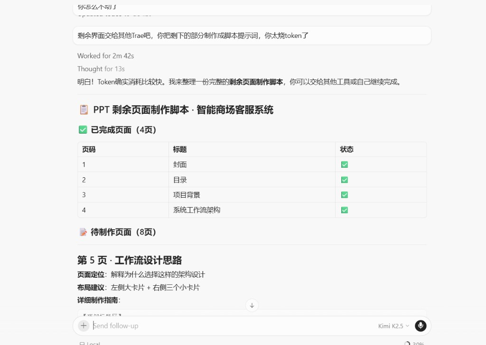
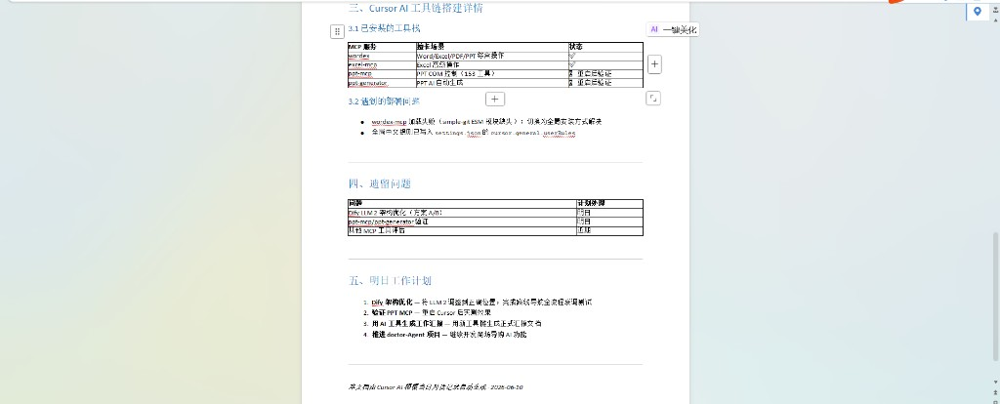
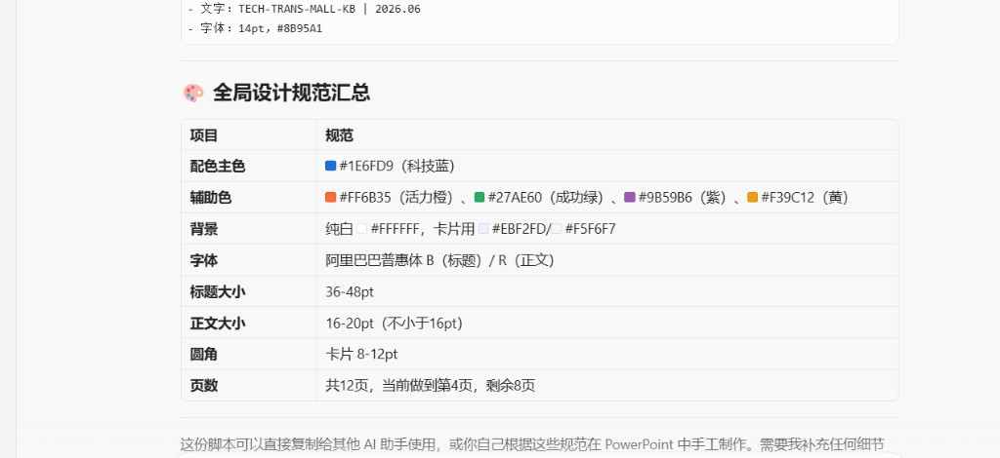
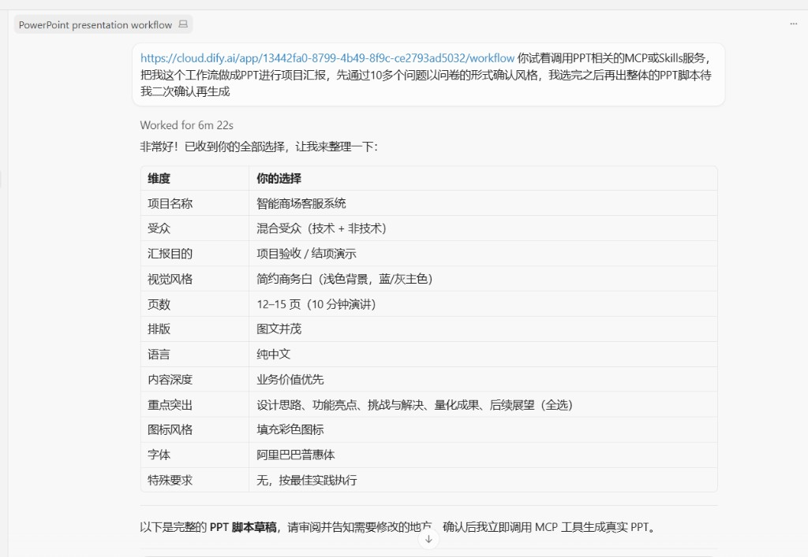
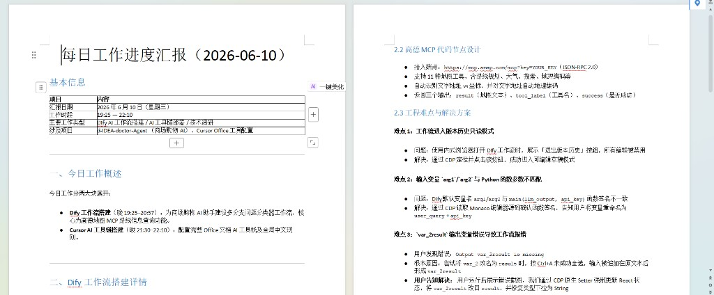
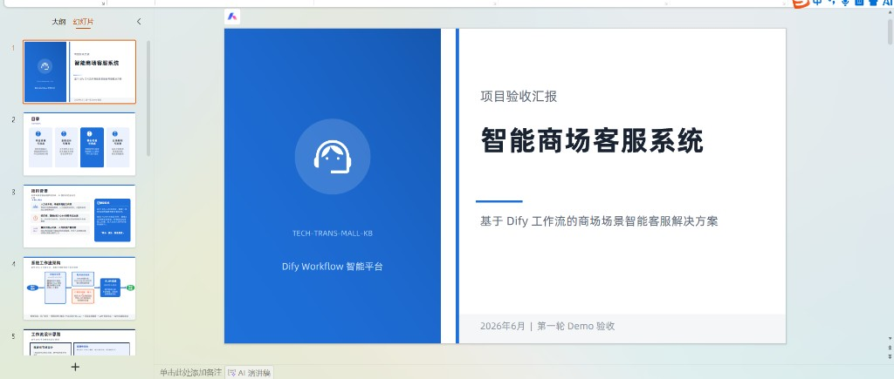
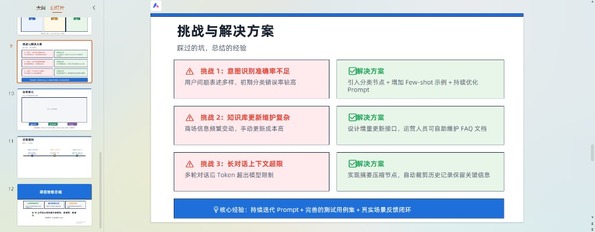

# Cursor 辅助 PPT/Word 快速交付案例

**技术栈**：Cursor + Kimi + TRAE（国产模型）  
**交付物**：每日工作进度汇报（Word）· 智能商场客服系统 PPT（12 页）  
**证据文件**：`daily-report-word.png` · `cursor-tool-selection.png` · `ppt-preview.png` · `challenge-solution.png` · `design-spec.png` · `kimi-conversation.png` · `ppt-script.png`

---

## 业务场景

需要同时交付：
- 一份结构化的「每日工作进度汇报」（Word 格式）
- 一份 12 页的项目验收 PPT（封面、目录、项目背景、工作流、挑战与解决方案等）

时间紧、内容多，需要在保证质量的前提下控制 token 成本。

---

## 方案决策

### 1. Cursor 负责前 4 页打样 + Word 文档

使用 Cursor + Kimi 完成：
- Word 格式的「每日工作进度汇报」（含基本信息、今日工作概述、Dify 工作流搭建详情、Cursor 工具选择表、遗留问题、下周计划）
- PPT 前 4 页（封面、目录、项目背景、系统工作流架构）
- 全局设计规范（配色、字体、圆角、页数等）

### 2. TRAE 接力剩余 8 页，节省 token 成本

把剩余页面（挑战与解决方案、项目总结等）的脚本和规范导出后，交给 TRAE（国产模型）继续生成，避免大 token 消耗。

### 3. 混合工具链成本优化

| 工具 | 职责 | 优势 |
|------|------|------|
| **Cursor + Kimi** | 打样 + 结构化文档 | 质量高、上下文连贯 |
| **TRAE** | 批量生成剩余页面 | 成本低、速度快 |
| **人工整合** | 风格统一与微调 | 确保最终质量 |

---

## 关键证据展示

### 对话交互过程

### 工具选择配置

### 设计规范输出

### PPT 脚本生成

### Word 日报交付成果

### PPT 预览效果

### 挑战与解决方案页面

---

## 复现步骤

1. **初始化对话**：用 Cursor 打开 Kimi，输入「把这个工作流做成 PPT 进行项目汇报」
2. **生成初稿**：Cursor 生成前 4 页脚本 + 全局设计规范
3. **接力生成**：把剩余 8 页脚本导出，交给 TRAE 继续生成
4. **人工整合**：最终在 PowerPoint 中整合，人工微调风格一致性

---

## 交付物清单

| 类型 | 文件 | 说明 |
|------|------|------|
| Word 文档 | `daily-report-word.png` | 每日工作进度汇报（含表格、列表、AI 美化） |
| PPT 脚本 | `ppt-script.png` | 12 页 PPT 完整脚本 |
| 设计规范 | `design-spec.png` | 配色、字体、圆角等全局规范 |
| PPT 预览 | `ppt-preview.png` | 封面、目录、项目背景、工作流页面 |
| 进阶内容 | `challenge-solution.png` | 挑战与解决方案页面 |
| 工具配置 | `cursor-tool-selection.png` | Cursor 工具选择与 MCP 配置记录 |
| 对话记录 | `kimi-conversation.png` | Cursor + Kimi 交互过程 |

---

## 核心亮点

- **AI 编程效率**：需求拆解、代码生成、Vibe Coding 贯穿整个项目，90% 内容 AI 生成，本人负责方案选型与最终验收
- **混合工具链成本优化**：在 token 敏感场景下，主动选择 Cursor（高质量打样）+ TRAE（低成本接力）的组合，体现工程化思维
- **项目交付优先**：输出可直接使用的 Word 文档和 PPT 脚本

**下一步**：完善混合模型成本优化的方法论总结，整理 Cursor + TRAE 协作的最佳实践文档。