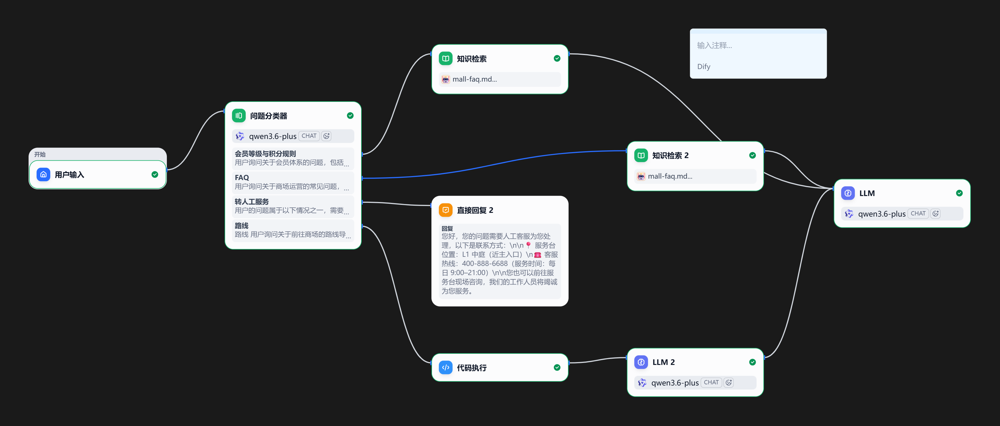

# Tech-Trans 商场智能客服 RAG 系统

**技术栈**：Dify Workflow + 阿里云百炼  
**时间**：2026.06  
**状态**：v0.8 · 14/25 Pass（#15–#25 待测）  
**证据文件**：`feeding-test-log.md` · `tech-trans-mall-kb-whole-workflow.png` · `knowledge-base-description.md` · `mall-faq.md` · `member-rules.md`

---

## 业务问题

商场智能客服需要准确回答会员积分、停车收费、楼层导览、品牌查询等高频问题，同时在知识库无覆盖时正确拒答并转人工。传统单模型容易出现以下问题：

- **日期幻觉**：编造不存在的活动日期
- **数字对照表污染**：错误引用停车收费标准
- **品牌误判**：回答未入驻品牌的位置信息
- **多轮记忆推测**：基于历史对话产生错误推断

---

## 方案决策

### 1. 知识库投喂与规则梳理

整理三类核心文档，设计品类/品牌分流 Q&A 与负例模板：

- **会员规则**：积分计算、等级权益、会员日活动
- **停车标准**：各会员等级停车时长与收费规则
- **楼层导览**：品牌分布、营业时间、设施位置

通过负例模板解决「优衣库/海底捞」等未入驻品牌的幻觉问题。

### 2. 测试集驱动的喂养迭代

设计 25 条覆盖常规/边界/多轮递进的测试用例，v0.1 → v0.8 共 8 轮迭代，沉淀可复用喂养记录与 Prompt 纠错模板。

### 3. 反馈优化闭环

引入 few-shot + 禁推测指令 + 会员一览表，修复多轮问钻石停车「6 元/6 小时」幻觉，确保「有知识必答、无知识拒答转人工」。

### 4. 文档与交付

输出操作手册、喂养记录、测试回归表与 Dify Workflow 截图，便于团队快速复现与持续维护。

---

## 工作流架构



**工作流核心节点**：
- **用户输入**：接收用户问题
- **意图识别**：判断问题类型（会员/停车/楼层/品牌）
- **知识库检索**：调用向量数据库进行语义匹配
- **重排序**：使用 qwen3-rerank 提升相关性
- **回答生成**：结合 Prompt 模板生成最终回复
- **拒答判断**：检测是否需要转人工

---

## 关键证据（feeding-test-log.md 核心摘要）

### 测试集分布

| 类别 | 数量 | 编号 |
|------|------|------|
| 常规用例 | 11 | #1–#7, #9, #15, #18–#23 |
| 边界/红字用例 | 10 | #8, #10–#14, #16–#17, #24–#25 |
| 总计 | 25 | |

### Bad Case 回归记录

| 编号 | 问题描述 | 根因分析 | 修复措施 |
|------|----------|----------|----------|
| #11 | 会员日三倍积分幻觉 | Prompt 缺乏日期约束 | FAQ 负例 + Prompt 纠错 |
| #12 #13 | 金卡停车数字幻觉 | 对照表数据错误 | 删除错误对照表 + 术语 Q&A |
| #8 | 化妆品楼层误判 | 品牌分类不清晰 | 品类/品牌分流 |
| #10 #24 | 品牌拒答验证 | 缺乏品牌白名单 | Prompt 品牌拒答模板 |
| #16 #25 | 多轮钻石停车推测 | 上下文记忆污染 | 会员一览表 + 禁推测指令 |

### 迭代进度

```
v0.1 → v0.6: 14/14 Pass
v0.6 → v0.8: 14/25 Pass（新增 11 条边界用例）
目标 v1.0: 25/25 Pass
```

---

## 核心配置

### Prompt 模板设计

```
你是一个专业的商场智能客服，请严格按照以下规则回答：

1. **知识库优先**：仅依据知识库内容回答，不得编造
2. **禁止推测**：知识库没有的信息，明确回复「暂无该信息」
3. **品牌拒答**：未入驻品牌（如优衣库、海底捞）请转人工
4. **格式友好**：使用清晰的列表和分段

会员等级对照：
- 普通会员：无停车优惠
- 银卡会员：2小时免费
- 金卡会员：4小时免费
- 钻石会员：6小时免费
```

### 检索参数

- **TopK**：10（向量检索）
- **关键词 TopK**：50
- **重排序模型**：qwen3-rerank
- **分段长度**：600 字符

---

## 复现步骤

1. **克隆仓库**：`git clone https://github.com/Mdaszly/ai-portfolio.git`
2. **进入目录**：`cd ai-portfolio/dify-rag-mall-kb`
3. **查看测试用例**：阅读 `feeding-test-log.md` 了解 25 条测试问句
4. **导入工作流**：在 Dify 中导入工作流（架构参考 `tech-trans-mall-kb-whole-workflow.png`）
5. **配置知识库**：按 `knowledge-base-description.md` 设置索引参数
6. **运行测试**：依次测试 #1–#25，观察 14/25 Pass 结果

---

## 交付物清单

| 文件 | 类型 | 说明 |
|------|------|------|
| `feeding-test-log.md` | 测试文档 | 25 条测试用例 + 8 轮迭代记录 |
| `tech-trans-mall-kb-whole-workflow.png` | 架构图 | Dify Workflow 完整架构 |
| `knowledge-base-description.md` | 配置文档 | 知识库创建与索引设置说明 |
| `mall-faq.md` | 知识文档 | 商场常见问题解答 |
| `member-rules.md` | 知识文档 | 会员规则与权益说明 |

**下一步**：继续扩展 #15–#25 测试用例，目标 v1.0 全量 Pass。